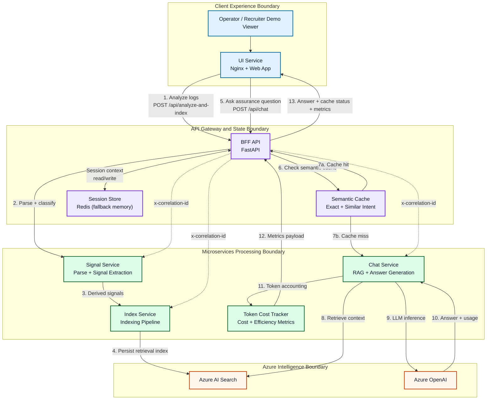

# Target Microservice Architecture

## Goal
Move from CLI interaction to a web GUI while preserving existing domain logic and making the solution runnable in Docker.

## High-Level Diagram

## Showcase Value

- **Interview-Friendly Narrative**: The numbered flow is designed for live demos in architecture rounds.
- **Strong Microservice Story**: Distinct boundaries for edge, state, processing, and cloud dependencies.
- **AI Engineering Maturity**: Combines RAG, semantic caching, observability, and token economics in one cohesive system.

## Layers

### Presentation Layer
- UI service (Nginx + static web app)
- BFF service (FastAPI) used only by the UI

### Application Layer
- signal-service: parse logs, extract signals, classify assurance
- index-service: push signals into Azure AI Search
- chat-service: ask assurance questions using Azure AI Foundry

## Request Flow
1. User uploads or pastes logs in UI.
2. UI calls BFF /api/analyze-and-index.
3. BFF sends logs to signal-service.
4. BFF sends derived signals to index-service.
5. User asks chat question in UI.
6. UI calls BFF /api/chat.
7. BFF checks semantic cache (exact first, then similar-intent).
8. On cache miss, BFF forwards question and stored context to chat-service.
9. Response is shown in the UI with cache status indicator.

## Service Boundaries and Module Mapping
- signal-service uses existing modules in src/log_reader.py, src/signal_engine.py, src/assurance_model.py
- index-service uses src/rag_indexer.py
- chat-service uses src/rag_chatbot.py, src/token_cost_tracker.py (for token metrics)
- bff aggregates responses, performs semantic caching, and forwards token/cache metadata to UI

## Container Topology
- ui on port 8080
- bff on port 8000
- signal-service on port 8001
- index-service on port 8002
- chat-service on port 8003

All services are attached to one internal Docker bridge network.

## Token Usage & Cost Tracking Layer

**New in v2**: Automatic token usage and cost calculation for all LLM responses.

- **chat-service** calls Azure OpenAI and extracts token usage from response
- **token_cost_tracker.py** calculates:
  - USD cost based on model pricing
  - Efficiency metrics (tokens per character, context balance)
  - Grades responses A-F
- **BFF** forwards token metrics in API response to UI
- **UI** displays metrics badge with tokens, cost, and efficiency

**Benefits**:
- Real-time cost transparency
- Identify optimization opportunities
- Track efficiency trends
- Compare models automatically

**Configuration**:
- Update pricing in `src/token_cost_tracker.py` if rates change
- All supported models pre-configured (gpt-4o, gpt-4o-mini, gpt-4-turbo, etc.)
- Metrics logged as structured JSON for auditing

See [TOKEN_TRACKING_GUIDE.md](TOKEN_TRACKING_GUIDE.md) for detailed metrics and tuning.

## Semantic Cache Layer

**New in v2.1**: Intent-aware cache for repeated and paraphrased questions.

- **Scope**: Session-local cache keyed by `session_id`
- **Exact Match**: Normalized question hash lookup
- **Similar Match**: Intent token overlap scoring with synonym normalization
- **Storage**: Redis when available; in-memory fallback in dev
- **TTL**: Controlled via `CHAT_CACHE_TTL_SECONDS` (default 900s)
- **Threshold**: Controlled via `CHAT_SIMILARITY_THRESHOLD` (default 0.30)

Response metadata returned by `/api/chat`:
- `cache_hit`: true/false
- `cache_match`: `none`, `exact`, or `similar`
- `cache_similarity_score`: 0.0-1.0

UI behavior:
- `Fresh response` when cache miss
- `Served from exact cache` for exact repeats
- `Served from similar cache (score)` for intent matches

Benefits:
- Improves consistency for repeated questions
- Reduces LLM calls and token costs
- Improves perceived responsiveness in interactive chat

## Production Hardening

**Session Storage**: Redis-backed with TTL (default 3600s)
- BFF connects to Redis on startup
- Falls back to in-memory if Redis unavailable
- Configure via REDIS_URL, SESSION_TTL_SECONDS env vars
- See [REDIS_TUNING.md](REDIS_TUNING.md) for connection tuning

**Authentication** (optional):
- API Key: `BFF_API_KEY` env var
- JWT: `JWT_REQUIRED=true` + `JWT_SECRET`
- Internal token propagation via `INTERNAL_API_TOKEN`

**Observability**:
- Correlation IDs propagated across all services (x-correlation-id header)
- Structured JSON logging with events: analyze_completed, index_completed, chat_completed, chat_fallback, chat_cache_hit, chat_cache_similar_hit
- Token usage metrics logged automatically

## Notes
- Redis session storage is recommended for production; in-memory fallback available for dev
- For petabyte-scale OSS, add asynchronous job processing (Celery + message queue)
- Token metrics are computed at response time; no additional latency
