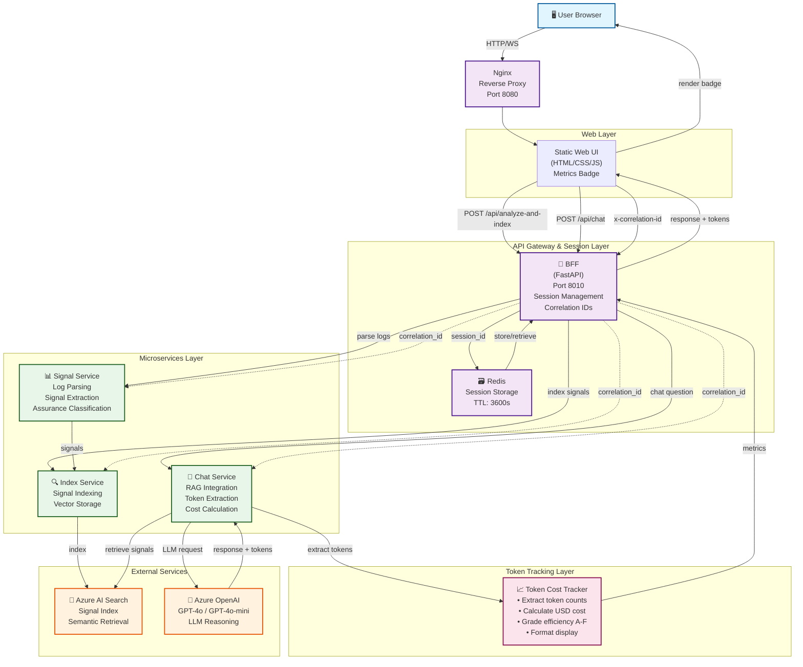

# AI‑Assisted Service Assurance Log Insight Bot
*(Azure AI Foundry POC)*

## Overview

This repository contains a **small, explainable Proof‑of‑Concept (POC)** chatbot designed to demonstrate how **Azure AI Foundry** can be used to assist **Service Assurance** teams in a telecom OSS environment.

The solution analyzes OSS log files and converts them into **service‑level insights** rather than raw technical alerts.  
The focus of this POC is **architectural clarity, domain reasoning, and explainability**, not scale or full automation.

This project is intentionally minimal and realistic, suitable for discussion in **Solution Architect interviews** or technical design reviews.

---

## Problem Statement

Traditional OSS monitoring tools generate large volumes of logs and alarms, but Service Assurance engineers still need to:
- Correlate symptoms manually
- Infer service impact from infrastructure‑level signals
- Spend significant time reading logs instead of reasoning about services

Rule‑based or threshold‑based systems can detect anomalies, but they **do not explain** what the issue means from a **service assurance perspective**.

---

## Solution Approach

This POC demonstrates how an **LLM‑powered chatbot**, grounded using **Azure AI Foundry + Retrieval‑Augmented Generation (RAG)**, can:

- Analyze OSS logs semantically
- Identify abnormal behavior
- Classify the issue in Service Assurance terms
- Explain potential service impact
- Suggest next investigation steps

The chatbot **assists engineers** rather than replacing them and always produces **explainable, domain‑aware output**.

---

## Architecture

### Complete System Architecture



### Architecture Components

**Web Layer** (Blue)
- **Static Web UI**: Single-page application (HTML/CSS/JavaScript) with metrics badge display for token costs and efficiency grades

**API Gateway & Session Layer** (Purple)
- **BFF (Backend-for-Frontend)**: FastAPI gateway that orchestrates microservices, manages sessions via Redis, and propagates correlation IDs for distributed tracing
- **Redis**: Session storage with automatic TTL (default 3600 seconds); provides memory-efficient session management and fallback to in-memory if unavailable

**Microservices Layer** (Green)
- **Signal Service**: Parses raw OSS logs, extracts domain-specific signals, and classifies assurance relevance
- **Index Service**: Pushes signals into Azure AI Search for semantic vector retrieval
- **Chat Service**: Implements RAG by retrieving signals and querying Azure OpenAI; extracts token usage and calculates efficiency metrics

**External Services** (Orange)
- **Azure AI Search**: Semantic vector database storing signals indexed by domain and assurance domain
- **Azure OpenAI**: LLM endpoint (supports gpt-4o, gpt-4o-mini, gpt-4-turbo, etc.) for domain reasoning

**Token Tracking Layer** (Pink)
- **Token Cost Tracker**: Extracts prompt/completion tokens from LLM responses, calculates USD costs based on model pricing, grades efficiency A-F, and formats costs (µ$, m$, $) for display in the GUI

**Observability** (Dashed lines)
- **Correlation IDs**: Propagated via `x-correlation-id` header across all services for distributed tracing and audit logging
- **Structured Logging**: All services emit JSON events (analyze_completed, index_completed, chat_completed, chat_fallback) with correlation IDs and token metrics

---

# Key Design Decisions

## Why Azure AI Foundry?

- Provides governance, prompt orchestration, and grounding
- Reduces hallucinations through controlled retrieval
- Aligns with enterprise cloud and compliance expectations

---

## Why Retrieval‑Augmented Generation (RAG)?

- Logs are treated as **knowledge**, not just events
- Prevents the model from guessing or inventing causes
- Improves trust and explainability in Service Assurance environments

---

## Why Keep This POC Small?

- Large AIOps platforms hide architectural decisions
- A minimal system makes reasoning, trade‑offs, and intent visible
- This mirrors how early‑stage innovation typically starts in telco environments

---

# Functional Scope

## What This POC Does

- Parses and chunks OSS log files
- Performs semantic search over logs
- Answers service‑oriented questions using an LLM
- Produces explainable Service Assurance insights

---

## What This POC Deliberately Does **NOT** Do

- Real‑time streaming ingestion
- Automated remediation
- Full alarm correlation
- Vendor‑specific behavior modeling

These exclusions are intentional to keep the design transparent, explainable, and interview‑appropriate.

---
# Token Usage & Cost Visibility

Every LLM response automatically tracks and displays:

- **Token Counts**: Prompt tokens + completion tokens + total
- **Cost in USD**: Automatic calculation based on model pricing (µ$, m$, or $)
- **Efficiency Metrics**: Grade A-F based on tokens per character + context balance
- **Real-Time Display**: Metrics badge appears below each answer in the GUI

**Example**: A response might show:
```
Tokens: 275 total (203 prompt, 72 completion)
Cost: 2.1m$ ($0.002095)
Efficiency: C grade (0.173 tokens/char) — Fair
Model: gpt-4o
```

This transparency helps teams:
- Understand LLM costs in real-time
- Optimize prompts and context for efficiency
- Compare models and pick optimal ones
- Track usage trends over time

For detailed guidance, see [TOKEN_QUICK_REFERENCE.md](TOKEN_QUICK_REFERENCE.md) or [TOKEN_TRACKING_GUIDE.md](TOKEN_TRACKING_GUIDE.md).

---
# Example Questions Supported

- “What abnormal behavior do you see in these logs?”
- “Is this a fault or a performance issue?”
- “Which service layer could be impacted?”
- “Is this likely a symptom or a root cause?”
- “What should a Service Assurance engineer investigate next?”

---

# Example Output

> “The logs indicate repeated downstream timeouts leading to delayed SLA monitoring updates. This suggests a performance degradation rather than a hard fault. From a Service Assurance perspective, this issue is likely to impact customer‑facing services if sustained. Further investigation should focus on dependency latency and service topology relationships.”

---

# Project Structure

```text
.
├── README.md
│   Overview, architecture, design decisions, usage
│
├── logs/
│   └── sample_telco_oss_logs.txt
│       Sample telco OSS logs (billing, network, SMS, core)
│
├── src/
│   ├── log_reader.py
│   │   Reads raw OSS log files and normalizes them
│   │
│   ├── signal_engine.py
│   │   Transforms logs into service-relevant signals
│   │   (error bursts, call drops, network degradation)
│   │
│   ├── assurance_model.py
│   │   Maps signals to Service Assurance concepts
│   │   (fault vs performance, service impact, root-cause likelihood)
│   │
│   ├── rag_indexer.py
│   │   Indexes derived signals into Azure AI Search
│   │   using Managed Identity (no secrets)
│   │
│   ├── rag_chatbot.py
│   │   Azure AI Foundry RAG query layer
│   │   Retrieves signals and generates explanations
│   │
│   ├── insight_generator.py
│   │   Produces human-readable assurance summaries
│   │   (used optionally before LLM reasoning)
│   │
│   └── main.py
│       Orchestrates the end-to-end flow
│       (logs → signals → index → RAG → insight)
│
└── .gitignore
    Excludes local files and credentials (no secrets in repo)

```

# Fact Check
Using raw logs directly in RAG does not scale for Tier‑1 telcos due to volume, cost, and noise.
In my design, logs are pre‑processed into service‑relevant signals, and only those insights are used in RAG.
Raw logs remain accessible as evidence, not primary knowledge.
