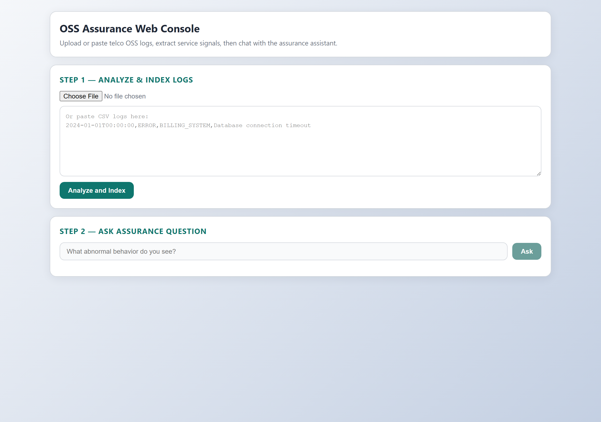
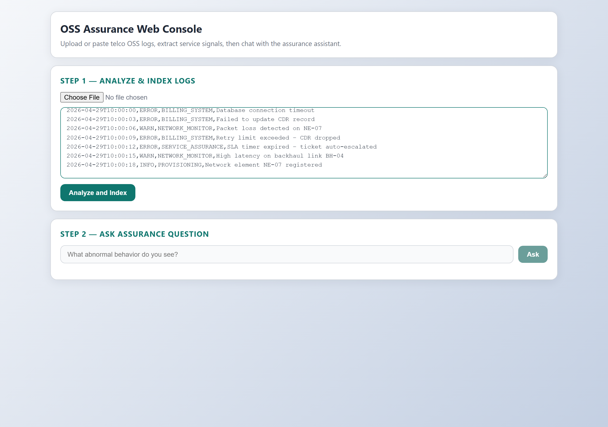
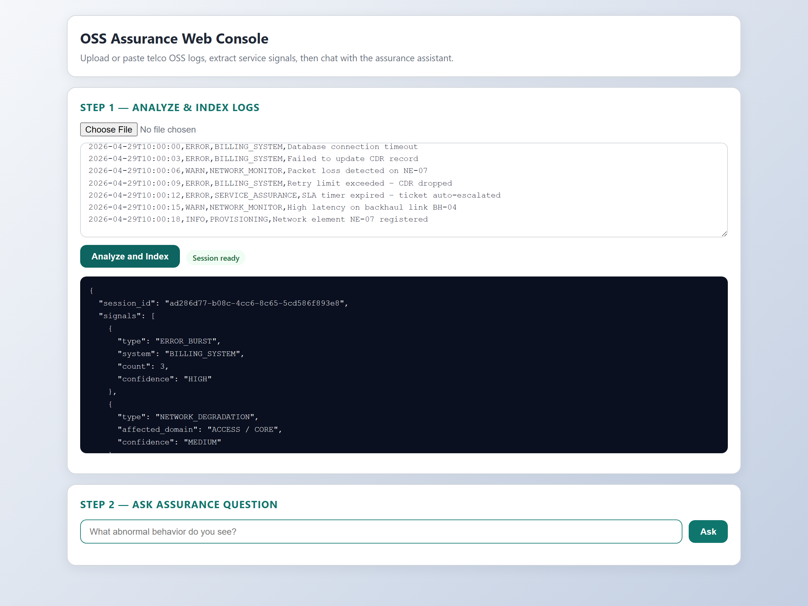
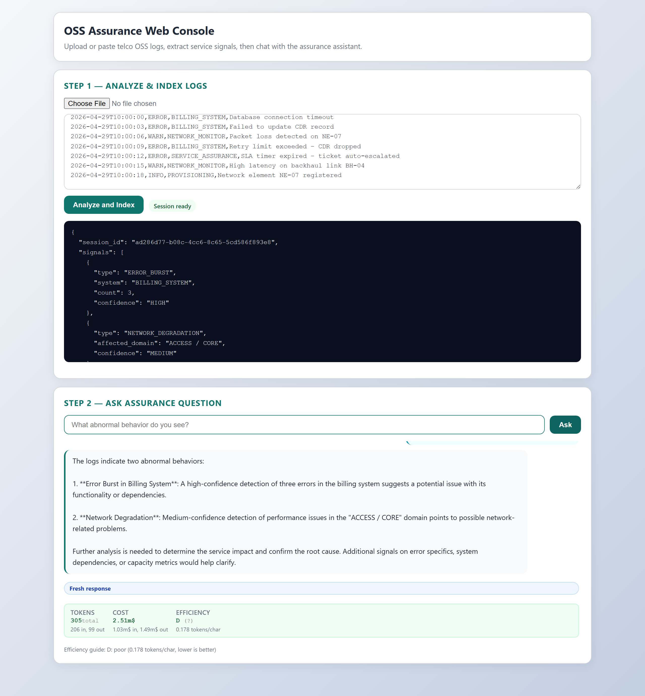
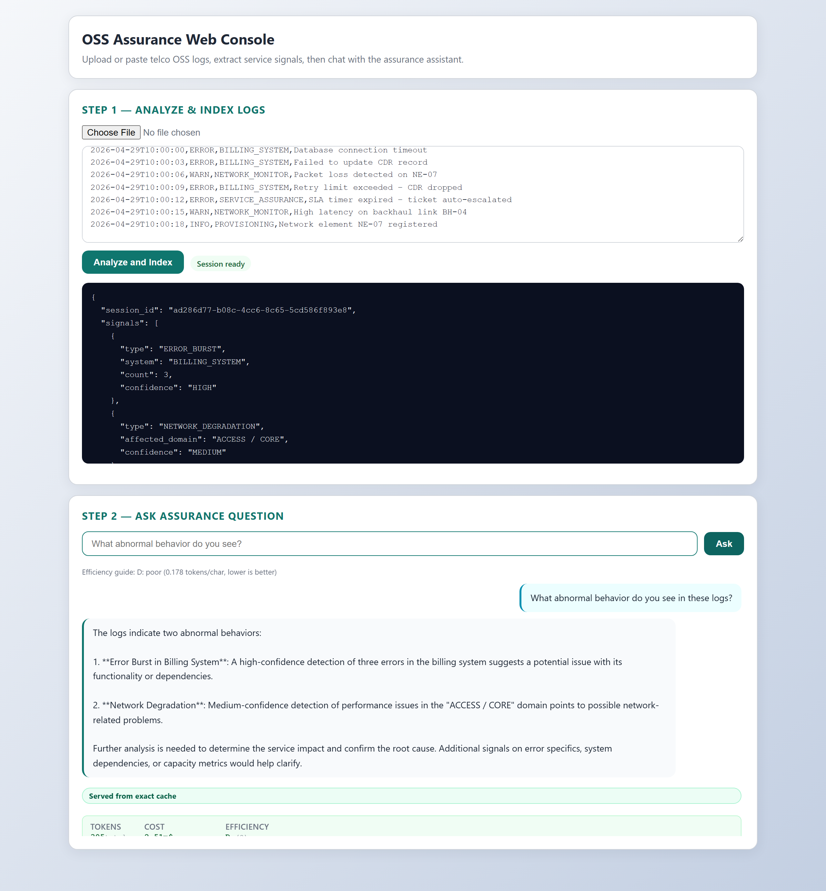
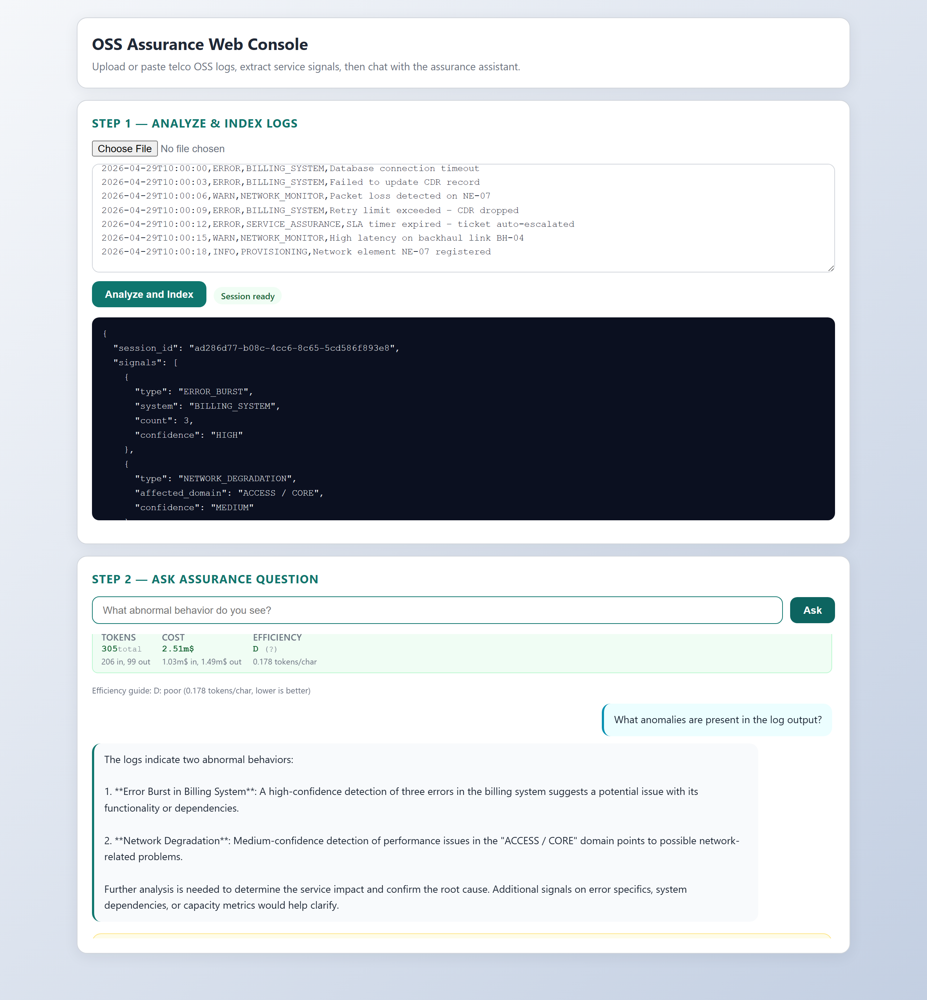
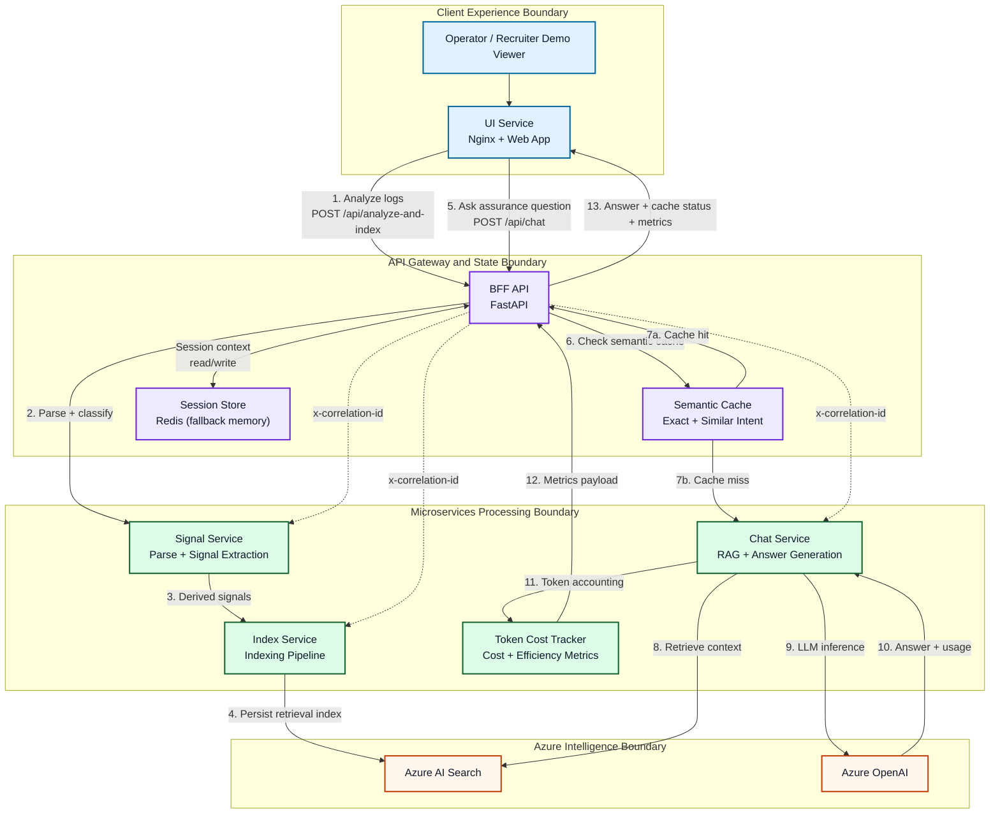

# AI‑Assisted Service Assurance Log Insight Bot

*(Azure AI Foundry POC)*

## Overview

This repository contains a **small, explainable Proof‑of‑Concept (POC)** chatbot designed to demonstrate how **Azure AI Foundry** can be used to assist **Service Assurance** teams in a telecom OSS environment.

The solution analyzes OSS log files and converts them into **service‑level insights** rather than raw technical alerts.
The focus of this POC is **architectural clarity, domain reasoning, and explainability**, not scale or full automation.

This project is intentionally minimal and realistic, suitable for discussion in **Solution Architect interviews** or technical design reviews.

---

## Screenshots

> All screenshots are taken from the live running application (Docker Compose stack on localhost).

### 1 · Landing Page — Empty State



### 2 · Logs Pasted — Ready to Analyze



### 3 · Analyze & Index Complete



### 4 · First Question — Fresh LLM Response



### 5 · Same Question Again — Exact Cache Hit



### 6 · Paraphrased Question — Similar Intent Cache Hit



### 7 · Token Cost & Efficiency Metrics


---

## Problem Statement

Traditional OSS monitoring tools generate large volumes of logs and alarms, but Service Assurance engineers still need to:

- Correlate symptoms manually
- Infer service impact from infrastructure‑level signals
- Spend significant time reading logs instead of reasoning about services

Rule‑based or threshold‑based systems can detect anomalies, but they **do not explain** what the issue means from a **service assurance perspective**.

## Architecture



### Why This Architecture Gets Attention

- **Interview-Friendly Narrative**: Numbered end-to-end flow is easy to explain live.
- **Strong Microservice Story**: Clear boundaries for edge, state, processing, and cloud dependencies.
- **AI Engineering Maturity**: Combines RAG, semantic caching, observability, and token economics.

### Demo Script Narrative (2-Minute Walkthrough)

1. **Open the web console** and explain that this PoC is a microservice-based OSS assurance assistant, not a monolithic chatbot.
2. **Paste sample OSS logs** and click Analyze and Index.
3. **Highlight the backend flow**: BFF orchestrates signal extraction, indexing, and session context management.
4. **Ask the first assurance question** (for example, "What abnormal behavior do you see?") and show a fresh LLM response.
5. **Point out cost transparency**: token count, USD cost, and efficiency grade are displayed immediately.
6. **Ask the same (or similar) question again** and show semantic cache behavior (exact/similar cache hit).
7. **Call out engineering maturity**: correlation IDs, cache metadata, deterministic output strategy, and secure container boundaries.
8. **Close with business value**: faster analyst triage, lower token cost, and explainable AI-assisted assurance outcomes.

### Architecture Components

**Web Layer** (Blue)

- **Static Web UI**: Single-page application (HTML/CSS/JavaScript) with metrics badge display for token costs and efficiency grades

**API Gateway & Session Layer** (Purple)

- **BFF (Backend-for-Frontend)**: FastAPI gateway that orchestrates microservices, manages sessions via Redis, and propagates correlation IDs for distributed tracing
- **Redis**: Session storage with automatic TTL (default 3600 seconds); provides memory-efficient session management and fallback to in-memory if unavailable
- **Semantic Cache**: Session-aware response cache with exact and intent-similar matching to improve repeatability and response latency

**Microservices Layer** (Green)

- **Signal Service**: Parses raw OSS logs, extracts domain-specific signals, and classifies assurance relevance
- **Index Service**: Pushes signals into Azure AI Search for semantic vector retrieval
- **Chat Service**: Implements RAG by retrieving signals and querying Azure OpenAI; extracts token usage and calculates efficiency metrics

**External Services** (Orange)

- **Azure AI Search**: Semantic vector database storing signals indexed by domain and assurance domain
- **Azure OpenAI**: LLM endpoint (supports gpt-4o, gpt-4o-mini, gpt-4-turbo, etc.) for domain reasoning

**Token Tracking Layer** (Pink)

- **Token Cost Tracker**: Extracts prompt/completion tokens from LLM responses, calculates USD costs based on model pricing, grades efficiency A-F, and formats costs (µ$, m$, $) for display in the GUI

**Observability** (Dashed lines)

- **Correlation IDs**: Propagated via `x-correlation-id` header across all services for distributed tracing and audit logging
- **Structured Logging**: All services emit JSON events (analyze_completed, index_completed, chat_completed, chat_fallback) with correlation IDs and token metrics

**Cache Observability**

- **Cache Metadata**: Chat API responses include `cache_hit`, `cache_match` (`exact` or `similar`), and `cache_similarity_score`
- **UI Indicator**: Chat answers display cache status as `Fresh response`, `Served from exact cache`, or `Served from similar cache (score)`

---

# Key Design Decisions

## Why Azure AI Foundry?

- Provides governance, prompt orchestration, and grounding
- Reduces hallucinations through controlled retrieval
- Aligns with enterprise cloud and compliance expectations

---

## Why Retrieval‑Augmented Generation (RAG)?

- Logs are treated as **knowledge**, not just events
- Prevents the model from guessing or inventing causes
- Improves trust and explainability in Service Assurance environments

---

## Why Keep This POC Small?

- Large AIOps platforms hide architectural decisions
- A minimal system makes reasoning, trade‑offs, and intent visible
- This mirrors how early‑stage innovation typically starts in telco environments

---

# Functional Scope

## What This POC Does

- Parses and chunks OSS log files
- Performs semantic search over logs
- Answers service‑oriented questions using an LLM
- Produces explainable Service Assurance insights

---

## What This POC Deliberately Does **NOT** Do

- Real‑time streaming ingestion
- Automated remediation
- Full alarm correlation
- Vendor‑specific behavior modeling

These exclusions are intentional to keep the design transparent, explainable, and interview‑appropriate.

---

# Token Usage & Cost Visibility

Every LLM response automatically tracks and displays:

- **Token Counts**: Prompt tokens + completion tokens + total
- **Cost in USD**: Automatic calculation based on model pricing (µ$, m$, or $)
- **Efficiency Metrics**: Grade A-F based on tokens per character + context balance
- **Real-Time Display**: Metrics badge appears below each answer in the GUI

**Example**: A response might show:

```
Tokens: 275 total (203 prompt, 72 completion)
Cost: 2.1m$ ($0.002095)
Efficiency: C grade (0.173 tokens/char) — Fair
Model: gpt-4o
```

This transparency helps teams:

- Understand LLM costs in real-time
- Optimize prompts and context for efficiency
- Compare models and pick optimal ones
- Track usage trends over time

For detailed guidance, see [TOKEN_QUICK_REFERENCE.md](TOKEN_QUICK_REFERENCE.md) or [TOKEN_TRACKING_GUIDE.md](TOKEN_TRACKING_GUIDE.md).

---

# Response Caching & Intent Matching

The chat flow now supports **session-scoped semantic caching**:

- **Exact Cache Match**: Same normalized question in the same session returns cached answer immediately.
- **Similar Cache Match**: Intent-similar paraphrases can reuse cached answers when similarity exceeds threshold.
- **Fresh Response**: On cache miss, BFF forwards to chat-service and stores the answer for future reuse.

Default behavior:

- `cache_hit=false` for first question
- `cache_hit=true, cache_match=exact` for exact repeats
- `cache_hit=true, cache_match=similar` for paraphrased repeats

Tunable settings:

- `CHAT_CACHE_TTL_SECONDS` (default 900)
- `CHAT_SIMILARITY_THRESHOLD` (default 0.30)

Benefits:

- More stable answers for repeated questions
- Lower latency for follow-up asks
- Reduced token spend for repeated and paraphrased queries

---

# Example Questions Supported

- “What abnormal behavior do you see in these logs?”
- “Is this a fault or a performance issue?”
- “Which service layer could be impacted?”
- “Is this likely a symptom or a root cause?”
- “What should a Service Assurance engineer investigate next?”

---

# Regression Testing (Do Not Break Future Improvements)

This repo now includes a lightweight regression safety net so future changes can be validated quickly.

## Test Layers

- **Fast unit regressions**: validate cache/intent logic without requiring Docker or Azure.
- **Live API regressions**: validate end-to-end behavior against a running stack on `http://localhost:8010`.
- **CI gate**: GitHub Actions runs fast unit regressions on each push/PR.

## Files Added for Regression Safety

- `tests/test_cache_logic.py` (offline unit regression tests)
- `tests/test_bff_api_live.py` (optional live API regression tests)
- `scripts/run_regression_tests.py` (cross-platform regression runner)
- `scripts/run_regression_tests.ps1` (optional Windows wrapper)
- `.github/workflows/regression.yml` (CI automation for unit regression checks)

## Local Commands

Run fast unit regressions only:

```bash
python -m unittest tests/test_cache_logic.py -v
```

Run both unit + live API regressions cross-platform (auto-skips live tests if BFF is not up):

```bash
python scripts/run_regression_tests.py
```

Run live API tests directly (requires running stack):

```bash
python scripts/run_regression_tests.py --live-mode always
```

Skip live tests explicitly (fast smoke):

```bash
python scripts/run_regression_tests.py --live-mode never
```

## Recommended Workflow For Every Change

1. Make code changes.
2. Run fast unit regressions.
3. If touching API/orchestration/cache behavior, run live API regressions.
4. Open PR and ensure CI passes before merge.

This pattern keeps confidence high while still allowing rapid iteration.

---

# Example Output

> “The logs indicate repeated downstream timeouts leading to delayed SLA monitoring updates. This suggests a performance degradation rather than a hard fault. From a Service Assurance perspective, this issue is likely to impact customer‑facing services if sustained. Further investigation should focus on dependency latency and service topology relationships.”

---

# Project Structure

```text
.
├── README.md
├── LICENSE
├── usage.md
├── ARCHITECTURE.md
├── WEB_GUI_SETUP.md
├── REDIS_TUNING.md
├── TOKEN_TRACKING_GUIDE.md
├── TOKEN_IMPLEMENTATION_SUMMARY.md
├── TOKEN_QUICK_REFERENCE.md
├── DOCUMENTATION_INDEX.md
├── docker-compose.yml
├── .env.tuning.example
├── token_tracking_demo.py
│
├── logs/
│   └── sample_oss_logs.txt
│
├── scripts/
│   ├── run.sh
│   └── wsl2_docker_setup.sh
│
├── services/
│   ├── ui/
│   │   ├── Dockerfile
│   │   ├── index.html
│   │   └── nginx.conf
│   ├── bff/
│   │   ├── Dockerfile
│   │   ├── main.py
│   │   └── requirements.txt
│   ├── signal_service/
│   │   ├── Dockerfile
│   │   ├── main.py
│   │   └── requirements.txt
│   ├── index_service/
│   │   ├── Dockerfile
│   │   ├── main.py
│   │   └── requirements.txt
│   └── chat_service/
│       ├── Dockerfile
│       ├── main.py
│       └── requirements.txt
│
└── src/
  ├── log_reader.py
  ├── signal_engine.py
  ├── assurance_model.py
  ├── rag_indexer.py
  ├── rag_chatbot.py
  ├── token_cost_tracker.py
  ├── insight_generator.py
  └── main.py

```

# Fact Check

Using raw logs directly in RAG does not scale for Tier‑1 telcos due to volume, cost, and noise.
In my design, logs are pre‑processed into service‑relevant signals, and only those insights are used in RAG.
Raw logs remain accessible as evidence, not primary knowledge.


env keys:


AZURE_OPENAI_ENDPOINT=

AZURE_OPENAI_MODEL="gpt-4o"

AZURE_SEARCH_ENDPOINT=

AZURE_SEARCH_INDEX=

AZURE_OPENAI_API_KEY=

AZURE_SEARCH_API_KEY=

AZURE_OPENAI_API_VERSION=
